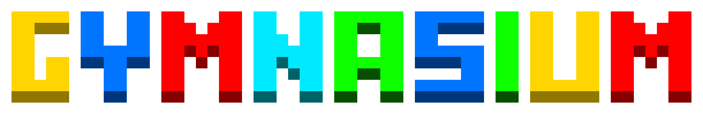
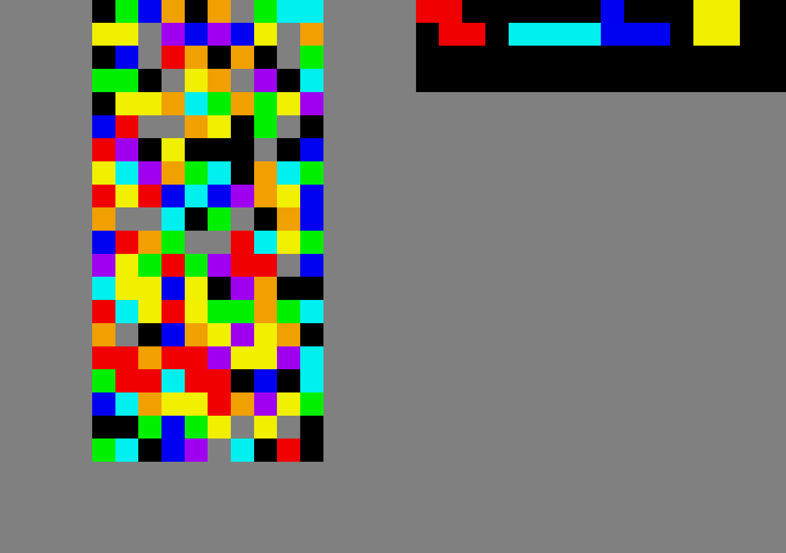
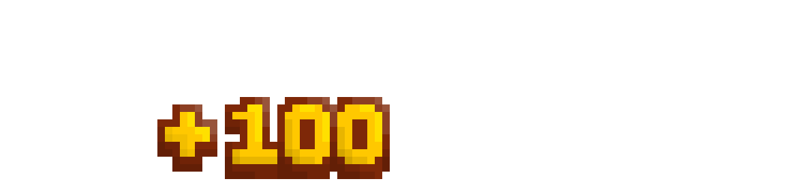
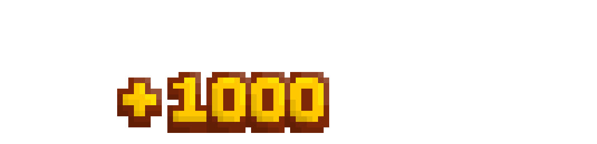
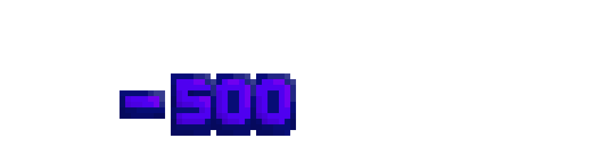
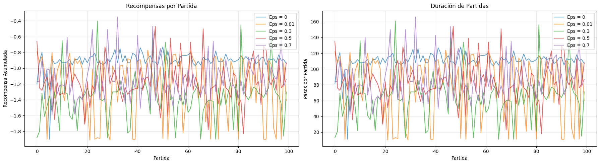
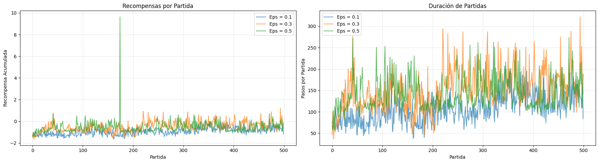
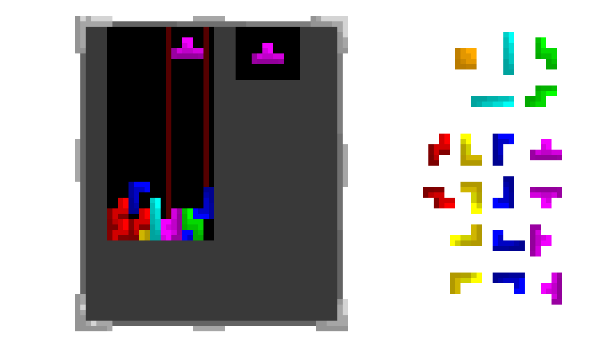
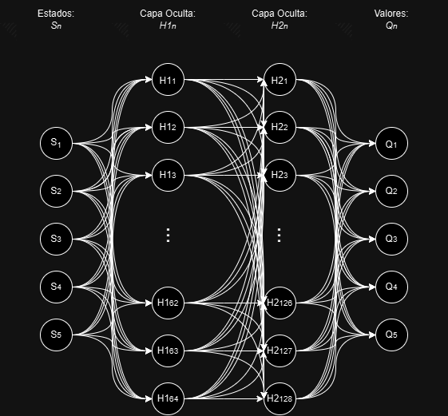
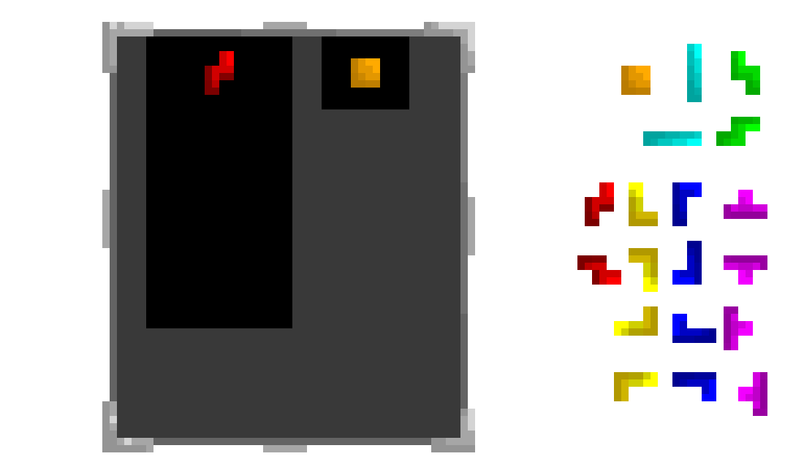

# Autoria:

# Universidad Mayor Real y Pontificia San Francisco Xavier de Chuquisaca

## **Estudiante:** Dario Alejandro Vildoso Flores

### **Carrera:** Ing. de Sistemas

### **Curso:** 7mo Semestre 

### **Materia:** Inteligecia Artificial I - SIS420 

### **Docente:** Pacheco Lora Carlos Walter

## Contacto:

Gmail: ltronf16@gmail.com

# Tetris Q-Learning Agent 

Este proyecto implementa un agente que aprende a jugar **Tetris** utilizando el entorno personalizado `tetris_gymnasium` compatible con `gymnasium`.



Para esto, se han implementado varios agentes utilizando diferentes métodos de **Aprendizaje por Refuerzo**.

---

## Descripción del Proyecto

Este proyecto es una prueba experimental de aprendizaje por refuerzo **sin usar directamente el estado del entorno**. El objetivo es explorar cómo un agente puede aprender a seleccionar acciones basándose en distintos parámetros.

El entorno utilizado es una versión de Tetris basada en `gymnasium`, con renderizado visual (`render_mode="human"`).

---

## El Desafío de Tetris



Tetris ha sido un reto lógico desde siempre. Aunque parezca un juego sencillo, contempla una complejidad matemática profunda, lo que supone un desafío de programación que ni hoy en día se puede superar completamente, puesto que no existe ningún algoritmo que garantice jugar una partida de Tetris de forma efectiva y eficiente indefinidamente.

La razón de la complejidad de Tetris yace en la cantidad de estados posibles que puede tener el juego. De manera muy resumida, el número de estados de Tetris se puede acotar de la siguiente manera:

- 1: Casilla llena
- 0: Casilla vacía

En un tablero tradicional de Tetris existen 20 filas × 10 columnas, por ende hay 200 casillas en total. Para acotar los casos posibles basta con multiplicar la cantidad de estados que puede tener cada casilla, es decir: 

$$ 2 \cdot 2 \cdot 2 \cdot 2... = 2^{200} \text{ posibilidades} $$

Aún reduciendo el límite tomando en cuenta las reglas del juego, se trata de una cantidad de estados tan inmensa que no se puede almacenar ni calcular.

### ¿Por qué es esencial cada estado?

Tomemos en cuenta un caso diferente: un brazo robot inteligente puede ser entrenado para buscar un objeto cerca de sus alrededores. Este brazo robot puede operar de manera que cada ángulo de rotación o cada posición del brazo sea considerado como un estado nuevo, lo que significa que, en el campo de los números reales, el robot teóricamente tendría estados infinitos. Sin embargo, esto se puede resumir de manera muy simple, pues lo que buscamos es que el robot alcance el objeto y no así que busque la mejor forma de hacerlo. Tomando en cuenta que hay varias formas de alcanzar un objeto, una persona puede extender su brazo y agarrar un objeto de 1000 formas distintas y eficientemente similares, por lo que para entrenar a este robot solamente se tiene que premiar aquellos estados donde el brazo esté cerca del objeto. De este modo, como en un juego de "frío y caliente", el brazo podrá alcanzar el objeto gracias a las señales que le damos.

Para el Tetris esto no se cumple, pues no hay un estado como tal o un conjunto de estados que podamos calificar como "bueno" o "malo", ya que no podemos asegurar que ciertas condiciones del juego sean efectivamente buenas o malas. Este tipo de problemas son considerados NP-completo, es decir, que no se sabe si haya o no un conjunto de reglas que eviten perder el juego durante un número dado de piezas, ni tampoco se puede asegurar una manera óptima de jugar Tetris, pues esto conlleva considerar una gran cantidad de estados y acciones.

**Entonces, ¿qué podemos hacer?**

---

## Solución

Como no podemos definir un algoritmo que elija la mejor ruta para jugar Tetris, podemos utilizar métodos de aprendizaje por refuerzo, de manera que el bot hará lo que le genere mejores recompensas. Sin embargo, estas recompensas dependen completamente de los parámetros que nosotros decidamos considerar en el juego, es decir, es una decisión arbitraria para cada persona qué es lo que va a analizar el bot para jugar de la mejor manera. Para esto existen varios métodos:

---

## Métodos de Acción-Valor

  

Estos son una serie de métodos que utiliza un agente (bot) para aprender qué hacer en cada problema considerando las recompensas que obtiene por cada acción. Es decir, el bot en un inicio tomará decisiones al azar siguiendo un parámetro $\epsilon$ que es un porcentaje de exploración. De este modo irá tomando decisiones en cada estado del juego y verá cuáles son las elecciones que generaron mayores recompensas para, posteriormente, luego de jugar varios juegos, haber definido las acciones que generan mayor recompensa y entonces empezará a elegir esas acciones para cada juego.

Para esto, definimos un algoritmo que realice una acción en el juego. Esta acción devolverá una recompensa que hayamos definido, esta recompensa se almacenará en un diccionario de recompensas $Q$ donde a cada acción corresponde una recompensa media. Luego de varias iteraciones, el bot tendrá la tabla $Q$ con una recompensa media para cada acción, y solo tendrá que elegir las acciones que hayan generado mayor recompensa. Sin embargo, hay varias formas de calcular las recompensas para cada acción.

Los métodos considerados en este proyecto son los siguientes:

### 1. Implementación Incremental
Este método calcula el valor de la tabla $Q$ tomando en cuenta los valores anteriores de la tabla y la tasa de cambio. Es decir, tras cada iteración, el valor de cada acción sumará en cierto porcentaje considerando la diferencia con el valor anterior, siguiendo la siguiente fórmula: 

$$Q_{n+1} = Q_n + \alpha [R_n - Q_n]$$

Donde:
- $\alpha \in (0, 1)$: Tasa de cambio entre valores
- $Q$: El valor para tal acción
- $R$: La recompensa obtenida

### 2. Intervalo de Confianza (UCB)
Este método cambia la forma en la que se explora el entorno. Es decir, en vez de definir un parámetro $\epsilon$ que defina un porcentaje de exploración, utilizaremos la siguiente ecuación: 

$$A_t = \underset{a}{\arg\max} \, \left[ Q_t(a) + c \sqrt{\frac{\ln \, t}{N_t(a)}} \right]$$

Donde:
- $t$: El instante en el que se encuentra el agente
- $A$: La acción a tomar
- $a$: Cada acción disponible
- $c$: Tasa de exploración
- $N$: Cantidad de veces que se efectuó la acción "$a$"

Este método permitirá que el agente explore aquellas acciones que menos ha tomado y que pueden tener mayor potencial.

### 3. Gradientes
Este método no busca tener una tabla que indique cuál es la mejor acción a tomar, sino que busca **preferencias**. Es decir, el agente tendrá una tabla que le diga cuáles opciones debería elegir, pero no se limita a elegir la que tenga mayor valor, sino que tendrá preferencias por las que tengan mayor valor, pero aún tendrá la opción de elegir otras.

Para hacer esto, definimos $\pi_t(a)$, que es una función que define la probabilidad de elegir la acción "$a$" en un tiempo "$t$":

$$\pi_t(a) = \frac{e^{H_t(a)}}{\sum_{b=1}^k e^{H_t(b)}}$$

Donde $H_t(a)$ se define con las siguientes reglas para ascenso de gradiente:

$$\begin{array}{ll}
H_{t+1}(a) = H_{t}(a) + \alpha(R_t-\tilde{R_t})(1-\pi_t(A_t)) & \text{si } a = A_t \\
H_{t+1}(a) = H_{t}(a) - \alpha(R_t-\tilde{R_t})\pi_t(a) & \text{para toda } a \neq A_t
\end{array}$$

Donde $\tilde{R_t}$ es el promedio de todas las recompensas obtenidas.

De este modo, mientras mayor sea el valor, mayor será la probabilidad de elegirlo.

### Limitaciones de los Métodos de Acción-Valor

Al hacer pruebas con todos estos métodos, podemos notar fácilmente que ninguno funciona correctamente. La mayoría de los bots terminan eligiendo una única acción a tomar porque en algún momento de la partida esa acción les dio una mayor recompensa, pero esto no tiene sentido en el contexto de Tetris, puesto que no existe una acción definida que podamos considerar como la mejor acción a tomar durante todo el juego.

En ocasiones, al explorar, el bot pudo haber limpiado una línea del juego por casualidad, obteniendo una mayor recompensa para la acción que realizó, lo que hará que prefiera utilizar esa acción aún sin saber por qué funcionó. Por lo tanto, la mayoría de estos agentes solo abusan de una acción durante todo el juego hasta que eventualmente pierden, obteniendo las siguientees estadísticas:



La excepción es el método de gradientes, pues al ser un método estocástico, este no sigue una sola acción a realizar, sino que a veces elige diferentes opciones. Sin embargo, esto no quiere decir que el algoritmo de gradientes en verdad esté aprendiendo mejor que los demás, solo que logra sobrevivir más tiempo gracias a que elige diferentes acciones en vez de solo una.



---

## Métodos de Q-Learning

Los métodos más avanzados de Q-Learning se basan en los métodos anteriores, pero ahora el agente no toma en cuenta solo las recompensas que recibe por cada acción, sino que también toma en cuenta el estado en el que se encuentra al hacer una acción. Es decir, la tabla "$Q$" ahora toma en cuenta 2 variables: acción y estado: $Q(s, a)$. Este tipo de métodos son los más indicados para resolver problemas como Tetris, donde no hay una acción definida que genere mejores recompensas, sino que dependen del estado en el que se encuentra el agente en cada momento.

### El Problema de la Representación del Estado

Pero aún hay un problema: habíamos dicho que Tetris cuenta con aproximadamente $2^{200}$ posibles estados, entonces ¿cómo podremos considerar cada estado para el agente?

Para resolver esto, es posible designar estados específicos con características propias, es decir, definir propiamente qué datos se van a tomar en cuenta para el estado. Cada persona que juegue Tetris puede definir sus propios estados para que el agente los considere. Por ejemplo, podemos considerar la altura máxima del tablero, pues cuando una persona juega Tetris constantemente busca que la altura sea lo mínimo posible, y dependiendo de eso toma acciones para bajar las columnas más altas.

De este modo podemos definir los valores más relevantes para los estados. Sin embargo, aún así nada nos garantiza que los estados utilizados sean verdaderamente los mejores a tomar en cuenta para el juego. Esto es un proceso de prueba y error, donde variamos los estados a tomar en cuenta y vemos qué tan bien aprende el agente.



### Definición de Estados y Recompensas

También hay que tomar en cuenta la recompensa para cada estado. Es decir, aún hay que indicarle al agente si es bueno o malo el valor de la altura. Para esto se definen las recompensas que recibe el agente con valores arbitrarios, es decir, que igualmente cada persona decide qué valor tiene cada estado. Puedes considerar que es mejor limpiar una línea, pero es malo si esto genera hoyos en las columnas. Todo esto se define en una función que toma los valores del estado y calcula una recompensa para dicho estado.

Para el proyecto tomamos en cuenta los "valles" del tablero, es decir, las zonas donde las columnas tienen menor altura, pues estos son los lugares donde ubicaremos las fichas para rellenar el mayor espacio posible en vez de crear torres que lleguen a la altura máxima y perder el juego.

Con esto definimos los siguientes valores:
- **Inicio del valle**: Ubicación del inicio del valle
- **Fin del valle**: Ubicación del fin del valle
- **Inicio bajo de la ficha**: Ubicación horizontal de la ficha activa en el tablero. Consideramos solo la ubicación de la parte inferior de la ficha, pues buscamos que la ficha encaje en el valle, es decir, que la parte más baja de la ficha debe encajar
- **Ancho de la ficha**: Espacio que ocupa la ficha para evitar colocar una ficha en un valle muy pequeño
- **Altura de la ficha**: Altura para conocer la posición completa de la ficha

### Cálculo de Recompensas

Para calcular las recompensas, primero buscamos que la parte inferior de la ficha entre en el valle actual, lo que fomenta rotar las fichas para cambiar la forma de la parte inferior. También buscamos que la ubicación de la ficha esté dentro del valle y, además, premiamos si la ficha está al borde del valle en vez de en el centro. Esto es mejor porque, de lo contrario, al colocar la ficha en medio de un valle generará 2 valles nuevos, lo que hará la tarea más tediosa, más una mayor recompensa si la ficha cabe exactamente en el valle.

Se utilizaron 2 algoritmos de aprendizaje con Q-Learning:

### 1. SARSA
Este método generará la tabla Q del mismo modo que lo hacen los algoritmos de Acción-Valor, pero tomando en cuenta el estado del juego actual, donde asignará un valor al estado en el que se encuentra y el valor que agrega cada acción. Sin embargo, también tomaremos en cuenta los estados futuros, es decir, el estado en el que quedamos luego de ejecutar una acción, para lo cual se usa la siguiente ecuación:

$$\hat{Q}(s, a) = Q(s, a) + \alpha \cdot \left [ R(s,a) + \left (\gamma \cdot Q(s',a') \right ) - Q(s,a) \right ]$$

Usamos la variable "$\gamma$" como una medida para tomar en cuenta el valor del siguiente estado en el que nos encontraríamos.

Este método debe ejecutarse para bastantes partidas, puesto que queremos que el agente toque todos o la mayoría de los estados de ser posible. Es por eso que es preferible utilizar el algoritmo de SARSA, pues este hace una exploración más amplia para buscar los valores de estados futuros.

Luego de entrenar con este algoritmo, el bot ya es capaz de ubicar los espacios disponibles en el tablero para colocar las piezas. Sin embargo, este aún no considera valores como la altura o si siquiera está completando líneas, solo busca rellenar los valles que encuentre por el escenario.

### 2. Deep Q-Learning
Este es un método más avanzado de inteligencia artificial. Este método en concreto le asigna un "cerebro" al agente. Este cerebro consiste en una red neuronal que ya no toma cada estado pasado como "único", sino que con una serie de regresiones define los valores para cada acción en cada estado $Q(s)$. Esto es beneficioso pues ahora el bot no solo verá estados únicos, sino que podrá aprender a reunir estados parecidos entre sí y, en base a esto, les asignará un valor para cada acción.

La red neuronal compuesta recibe el conjunto de estados y lo pasa por 2 capas ocultas para devolver los valores obtenidos para cada acción. Entonces el agente solamente elige la acción con valor mayor.



### Estados Adicionales para Deep Q-Learning

Dado que ahora no necesitamos explorar cada estado posible, se puede añadir más estados con características relevantes para el agente. En este caso, añadimos los siguientes:

- **Inicio y fin del valle medio**: Definimos un segundo valle que esta vez son las columnas menores al promedio de alturas de todas las columnas
- **Rugosidad**: La suma de las diferencias entre las columnas adyacentes
- **Total de hoyos**: La suma de los hoyos del tablero. Consideramos hoyos todas las casillas libres de una columna con al menos 1 casilla llena encima
- **Altura promedio**
- **Columnas llenas**: La cantidad de columnas que llegan a la altura máxima



### Sistema de Recompensas Avanzado

El sistema de recompensas ahora no solo recompensará posicionar la pieza de la forma correcta en el valle, sino que ahora también considerará si la pieza en concreto cabe en el valle, no solo la parte inferior. Mientras que también valorará la rugosidad del escenario, es decir, tratará de mantener el escenario lo más plano posible, y también penalizará fuertemente crear hoyos en el tablero, esto porque los hoyos entorpecen el objetivo de limpiar las líneas. Las columnas llenas también servirán como penalización para evitar crear más columnas altas.

Con este sistema, el agente ya puede mantenerse jugando una partida por un tiempo considerablemente mayor, ya que ha mejorado significativamente en su capacidad para tomar decisiones al momento de poner las piezas. Sin embargo, esto aún puede ser optimizado considerando los posibles estados y características necesarias para que el agente pueda conseguir mejores resultados.

---

## Instalación

### 1. Clonar el repositorio 
```bash
git clone https://github.com/Dario-Vildoso/TetrisBot
cd "Tetris Bot"
``` 

### 2. Dependencias

```bash
pip install gymnasium
pip install tetris-gymnasium
pip install matplotlib
pip install numpy
pip install torch
pip install tkinter
``` 

**Descripción de las librerías:**
- **Gymnasium**: Librería para IA con varios entornos disponibles, sirve para crear el entorno del juego y poder ejecutarlo
- **Tetris-gymnasium**: Este es el entorno para ejecutar Tetris, no se encuentra por defecto en los entornos de Gymnasium, por lo que es necesario instalarlo primero
- **Matplotlib**: Útil para generar las gráficas que muestran el comportamiento de los agentes que usan los métodos Acción-Valor
- **NumPy**: Librería para procesamiento de datos, permite manejar grandes volúmenes de datos de manera fácil y eficiente
- **Torch**: Librería de IA con funciones para crear redes neuronales avanzadas y poder entrenarlas o configurarlas de cualquier forma
- **Tkinter**: Añade funciones para generar formularios sencillos

También es necesario importar las siguientes librerías. Tomar en cuenta que se debe importar la librería de `tetris_gymnasium`, ya que sin esta, Gymnasium no será capaz de crear el entorno de ejecución del juego:

```python
import gymnasium as gym
from tetris_gymnasium.envs import Tetris
import numpy as np
import math
import matplotlib.pyplot as plt
from IPython.display import clear_output
import time
import cv2
import sys
from matplotlib.animation import FuncAnimation
import torch
from collections import deque
import random
import torch.nn as nn
import torch.optim as optim
import tkinter as tk
``` 

### 3. Estructura del Proyecto

El repositorio contiene 5 archivos `.ipynb` que utilizan los métodos mencionados anteriormente. El archivo `EntornoTetris.py` es un código ejecutable para hacer correr el juego, este mostrará las observaciones que devuelve el entorno de Gymnasium y la información relevante tras cada acción.

Cada archivo implementa el entorno y realiza los ajustes necesarios. Para los métodos de Acción-Valor se realizaron pruebas con distintos valores de "$\epsilon$" para ver el valor de la exploración en el bot. Para lo cual primero se debe ejecutar el entrenamiento con cada epsilon y luego imprimir la visualización con gráficas. Al final se muestra una partida con el bot ya entrenado.

Para los métodos de Q-Learning se implementaron ambos métodos en **Tetris-QLearning.ipynb**, donde se puede entrenar al agente que utiliza el método SARSA para recibir la tabla $Q$ con los valores para los estados.

Para el agente que utiliza Deep Q-Learning se requiere un entrenamiento extenso, por lo que se guardaron los pesos de la red neuronal en los archivos **tetris_dqn.pth**. Se puede cambiar la versión del modelo cambiando la celda:

```python
dqnPolicy = {}
policy_net = DQN(12, 8).to('cuda')  # Asegurarse que las entradas y salidas del modelo coincidan con las del modelo guardado
policy_net.load_state_dict(torch.load('tetris_dqn_v2.pth'))  # Cambiar por el archivo del modelo entrenado
dqnPolicy['policy_net'] = policy_net
dqnPolicy['policy_net'].eval()  # Asegurarse de que la red está en modo evaluación
```

Al final se puede ejecutar la última celda que utiliza un formulario con Tkinter para visualizar una partida de cada agente. Esta celda mostrará un output para debugging durante la partida para cada agente.